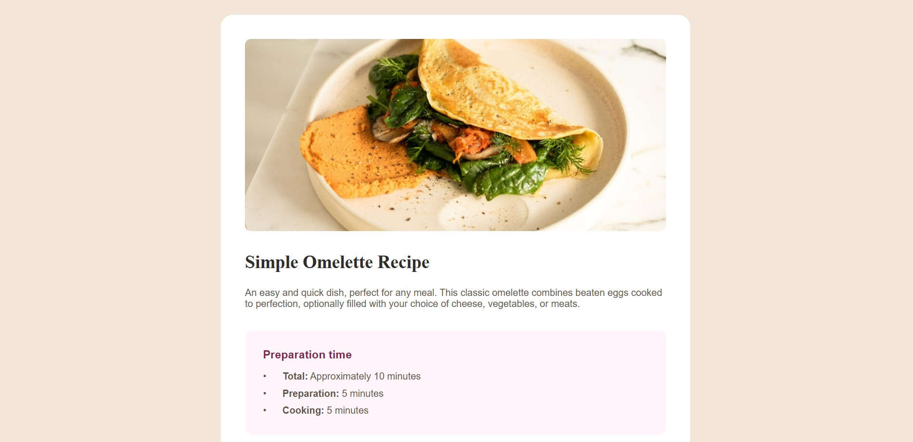
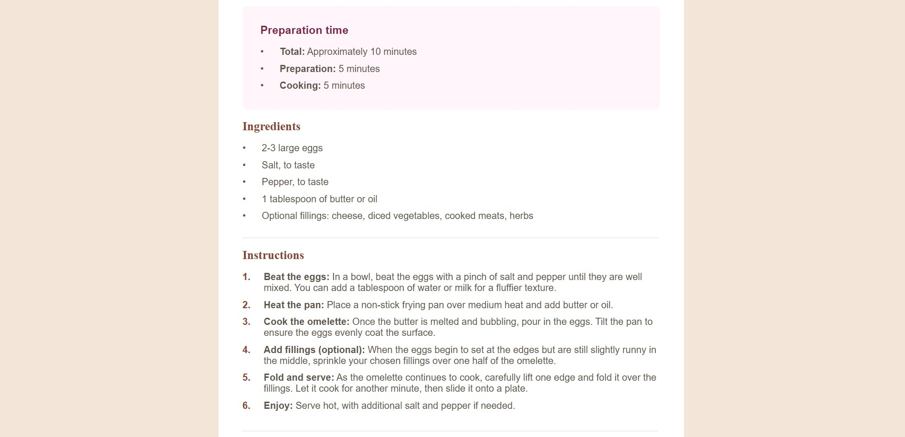
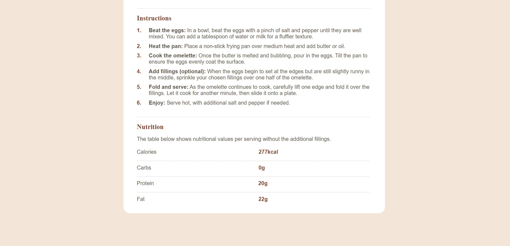

# Frontend Mentor - Recipe Page

# Recipe Page

A simple responsive QR Code card component built using **HTML** and **CSS**. This project is part of a challenge from [Frontend Mentor](https://www.frontendmentor.io).

## Overview

### Links

- Live Site URL: (https://hastigholami.github.io/recipe-page/)
- Solution URL: (https://github.com/hastigholami/recipe-page)

### Built With

- HTML
- CSS 
- Css Grid
- Flex box

## My Process

### What I Learned

In this project, I practiced:
- Structuring a simple HTML page
- Applying responsive styling using CSS
- Working with images and fonts
- Using Git and GitHub for version control
- Hosting projects live using GitHub Pages

### Continued Development

Next, I want to:
- Improve my CSS skills
- Start learning JavaScript
- Complete more Frontend Mentor challenges

## Author

- GitHub – (https://github.com/hastigholami)
- Frontend Mentor – (https://www.frontendmentor.io/profile/hastigholami)
- LinkedIn – (https://www.linkedin.com/in/hastigholami/)

## Acknowledgments

Thanks to [Frontend Mentor](https://www.frontendmentor.io) for the amazing challenges!
